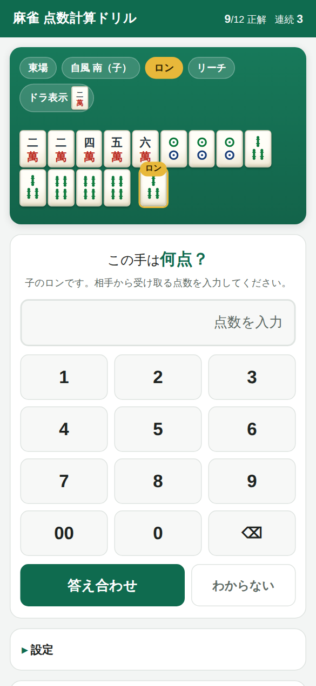
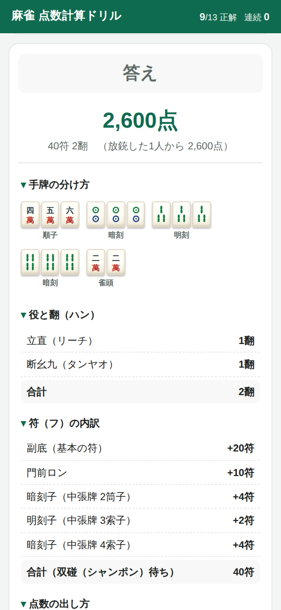

# 麻雀 点数計算ドリル

麻雀の点数計算をランダム問題で練習できる、スマホ向けのWebアプリです。
出題された手牌を見て「何点？」に答えると、正解・不正解と**計算の途中経過（役・符・点数の式）**を解説します。

| 出題画面 | 解説画面 |
| --- | --- |
|  |  |

---

## 使い方

### いちばん簡単な方法（インストール不要）

1. このリポジトリをダウンロード（緑の `Code` ボタン → `Download ZIP`）して解凍する
2. `index.html` をダブルクリックする

これだけでブラウザが開いて遊べます。インターネット接続もサーバーも不要です。

### スマホ（iPhone）で使う

公開URL 👉 **https://yuki-afroboy.github.io/mahjong-score-practice/**

SafariでこのURLを開くだけで使えます。さらにアプリのように使いたい場合は、
Safariの下部にある**共有ボタン（□に↑）→「ホーム画面に追加」**を選ぶと、
アイコンから全画面で起動できるようになります（アドレスバーが消えます）。

#### 初回だけ必要な設定（GitHubの画面での操作）

公開の仕組み（`.github/workflows/pages.yml`）は用意済みで、pushのたびに
「テスト実行 → GitHub Pages へ公開」が自動で走ります。
ただし**最初の1回だけ**、GitHubの画面で次の設定が必要です。

**① リポジトリを公開（Public）にする**

GitHubの無料プランでは、非公開（Private）リポジトリのGitHub Pagesは使えません。

1. リポジトリの `Settings` タブ
2. ページ最下部の `Danger Zone` → `Change repository visibility` → `Change to public`
3. 確認のためリポジトリ名を入力して実行

※ 非公開のままにしたい場合は、GitHub Pro（有料プラン）が必要です。

**② Pages を有効にする**

1. `Settings` → 左メニューの `Pages`
2. `Build and deployment` の `Source` を **GitHub Actions** に変更（自動で保存されます）

**③ 公開を実行する**

1. `Actions` タブ → 左の `Deploy to GitHub Pages` → 一番上の実行を開く
2. 右上の `Re-run all jobs` を押す
3. 緑のチェックになれば完了。1〜2分後に上記のURLが開けます

以降はコードを変更してpushするだけで自動的に更新されます。

---

## 画面の見かた

- **上の緑のエリア**＝問題。場風・自風（親か子か）・ロン/ツモ・リーチ・ドラ表示牌と、手牌が並びます
- **金色に光っている牌**＝上がり牌（ロン牌／ツモ牌）。待ちの形はここで決まります
- **手牌の下**＝鳴いた牌（チー・ポン・カン）。鳴きがある手は門前ではありません
- **答え方**＝受け取る点数の**合計**を入力します
  - ロンなら「相手1人から受け取る点数」（例: `5200`）
  - ツモなら「3人から受け取る合計点」（例: 700/1300 なら `2700`）
- 答え合わせ後は **手牌の分け方 → 役と翻 → 符の内訳 → 点数の出し方** の順に解説が出ます

### 難易度（設定から変更できます）

| 難易度 | 内容 |
| --- | --- |
| やさしい | 門前のみ（鳴きなし）・ドラなし・役満なし。まずはここから |
| ふつう | 鳴き（チー・ポン）とドラが登場します |
| むずかしい | カン・混一色・役満なども出ます |

成績（正解数・連続正解）はブラウザに保存されるので、閉じても続きから練習できます。

---

## 技術について（初心者向けメモ）

**HTML + CSS + JavaScript だけ**で作っています。ReactやNode.jsなどのツールは使っていません。
牌の絵柄も画像ファイルではなくSVG（図形）で描いているので、読み込みが速く、どんな画面サイズでもぼやけません。
理由は、①ビルド（変換作業）が不要でファイルを開けばすぐ動く、②コードを書き換えて保存 → ブラウザを更新するだけで結果が見える、③GitHub Pagesにそのまま置ける、からです。

### ファイル構成

```
index.html        画面の骨組み（どこに何を置くか）
css/style.css     見た目（色・大きさ・スマホ向けレイアウト）
js/tiles.js       牌のあつかい方（牌を0〜33の数字で表す）
js/tile-art.js    牌の絵柄をSVG（図形）で描画（画像ファイル不要）
js/score.js       点数計算エンジン（手牌の分解・役判定・符・点数）★このアプリの心臓部
js/generator.js   ランダムな問題づくり
js/app.js         画面の操作（表示・入力・答え合わせ）
tests/test.js     点数計算が正しいかを確かめるテスト
```

読む順番は `js/tiles.js` → `js/app.js` → `js/score.js` がおすすめです。

### テストの実行

点数計算のロジックには45件のテストがあります（Node.js が必要）。

```bash
node tests/test.js
```

`結果: 45 件成功 / 0 件失敗` と出ればOKです。
`score.js` を書き換えたら、まずこれを走らせて壊れていないか確認してください。

### 少し改造してみたい人へ

- 出題の傾向を変える → `js/generator.js` の `DIFFICULTY`（順子の出やすさ・鳴きの割合など）
- 色やサイズを変える → `css/style.css` の先頭にある `:root { --green: ... }` の部分
- 牌の絵柄を変える → `js/tile-art.js`（筒子の円の位置、索子の竹の並びなどを数字で指定しています）
- 役を追加する → `js/score.js` の `detectYaku()`

---

## 採用しているルール

一般的な日本のリーチ麻雀（クイタンあり・後付けあり）に合わせています。

- 符：副底20符／門前ロン+10符／ツモ+2符（平和ツモは20符固定）／七対子25符固定
- 明刻2符・暗刻4符（幺九牌はその倍）、明槓8符・暗槓16符（幺九牌はその倍）
- 待ち：カンチャン・ペンチャン・単騎は+2符、両面・シャンポンは0符
- 役牌の雀頭は+2符（連風牌＝ダブ東などの雀頭も2符として計算しています）
- 鳴いていて符がまったく付かない形（喰い平和形）は30符
- 満貫：5翻＝満貫、6〜7翻＝跳満、8〜10翻＝倍満、11〜12翻＝三倍満、13翻以上＝数え役満
- 切り上げ満貫（4翻30符・3翻60符を満貫にする）は**採用していません**
- 役満は基本点8000点で計算。複合役満（大三元＋字一色など）は重ねて数えますが、四暗刻単騎・大四喜などを1つで「ダブル役満」とするルールは採用していません
- 積み棒（本場）・供託リーチ棒・赤ドラ・裏ドラは含みません
- 国士無双は出題されません（他の役満は出ることがあります）

※ 符や満貫の扱いは団体・アプリによって差があります。使っている場のルールと違う場合は `js/score.js` を書き換えてください。
